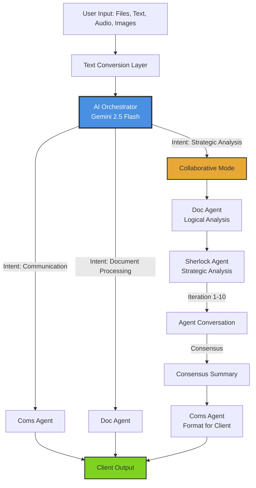
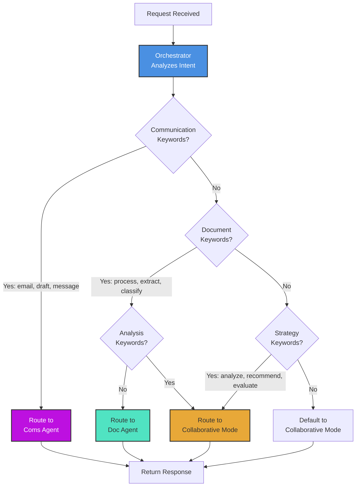
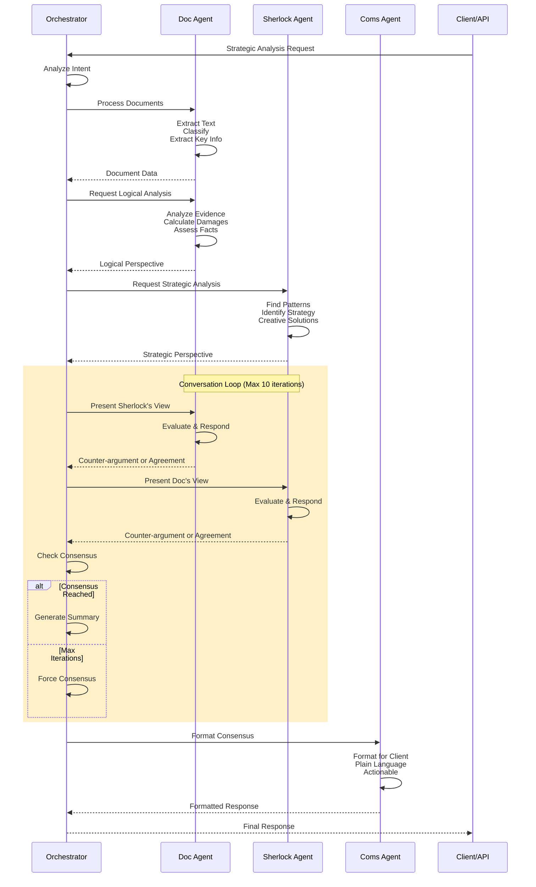
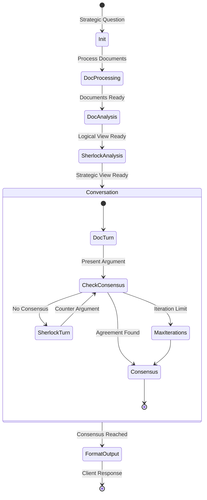
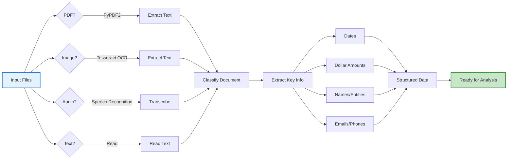
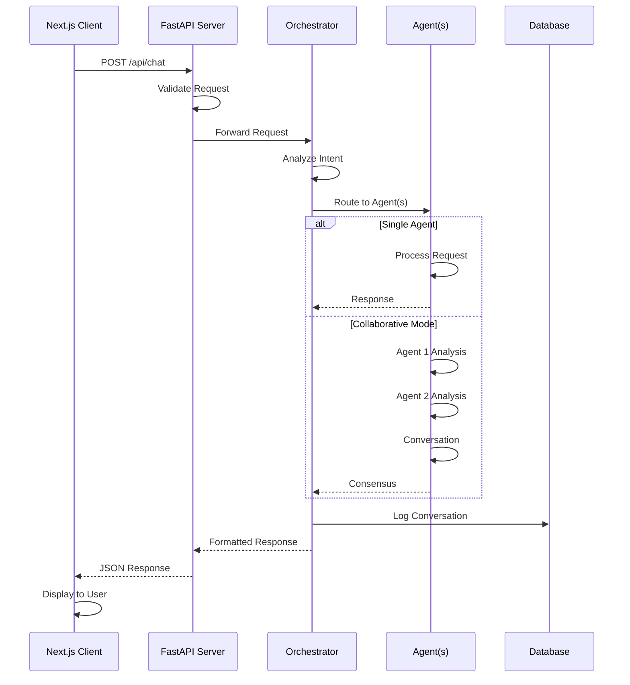

# AI Agents Workflow Diagrams

## Overall Architecture



## Routing Decision Flow



## Collaborative Mode Detail



## Agent Conversation Flow



## File Processing Pipeline



## API Request Flow



## Complete Workflow Example

```mermaid
graph TB
    Start[User: "Analyze case_1 and<br/>recommend settlement strategy"] --> API[POST /api/chat]
    
    API --> Orch[Orchestrator Receives]
    Orch --> Intent[Intent Analysis]
    
    Intent --> Keywords{Detect Keywords:<br/>analyze, recommend}
    Keywords --> Route[Route to<br/>Collaborative Mode]
    
    Route --> Step1[Step 1:<br/>Doc Agent Processes Files]
    Step1 --> Step2[Step 2:<br/>Doc Agent Logical Analysis]
    Step2 --> Step3[Step 3:<br/>Sherlock Strategic Analysis]
    
    Step3 --> Loop[Conversation Loop]
    
    Loop --> Iter1[Iteration 1:<br/>Doc presents facts]
    Iter1 --> Iter2[Iteration 2:<br/>Sherlock adds strategy]
    Iter2 --> Iter3[Iteration 3:<br/>Doc refines]
    Iter3 --> Iter4[Iteration 4:<br/>Sherlock agrees]
    
    Iter4 --> Check{Consensus?}
    Check --> |Yes| Consensus[Generate Consensus]
    Check --> |No + More Iters| Loop
    
    Consensus --> Format[Coms Agent<br/>Formats Response]
    Format --> Response[Return to Client]
    
    Response --> Display[Display:<br/>- Case Strength: Good 75/100<br/>- Settlement: $50k-65k<br/>- Strategy: Emphasize liability<br/>- Next Steps: 5 action items]
    
    style Start fill:#E8F5E9,stroke:#4CAF50,stroke-width:2px
    style Orch fill:#4A90E2,stroke:#333,stroke-width:2px,color:#fff
    style Loop fill:#FFF3E0,stroke:#FF9800,stroke-width:2px
    style Display fill:#C8E6C9,stroke:#388E3C,stroke-width:3px
```

## Use Case Examples

### Use Case 1: Quick Email Draft

```mermaid
graph LR
    User[User Request:<br/>"Draft email to client"] --> Orch[Orchestrator]
    Orch --> |Direct Route| Coms[Coms Agent]
    Coms --> Draft[Generate Email:<br/>- Greeting<br/>- Body<br/>- Closing]
    Draft --> Return[Return Draft]
    
    style Orch fill:#4A90E2,color:#fff
    style Coms fill:#BD10E0,color:#fff
```

### Use Case 2: Document Processing Only

```mermaid
graph LR
    User[User Request:<br/>"Process PDF documents"] --> Orch[Orchestrator]
    Orch --> |Direct Route| Doc[Doc Agent]
    Doc --> Extract[Extract Text]
    Extract --> Classify[Classify Types]
    Classify --> Keys[Extract Key Info]
    Keys --> Return[Return Structured Data]
    
    style Orch fill:#4A90E2,color:#fff
    style Doc fill:#50E3C2
```

### Use Case 3: Strategic Analysis (Collaborative)

```mermaid
graph TB
    User[User Request:<br/>"Should I settle or litigate?"] --> Orch[Orchestrator]
    Orch --> |Collaborative Route| Both[Doc + Sherlock]
    
    Both --> Doc[Doc Agent:<br/>Facts & Evidence]
    Both --> Sherlock[Sherlock Agent:<br/>Strategy & Patterns]
    
    Doc --> Talk[Agents Converse]
    Sherlock --> Talk
    
    Talk --> Cons[Reach Consensus]
    Cons --> Coms[Coms Formats]
    Coms --> Return[Return Recommendation]
    
    style Orch fill:#4A90E2,color:#fff
    style Both fill:#E8A838
    style Talk fill:#FFF3E0,stroke:#FF9800,stroke-width:2px
```

---

## Legend

**Colors:**
- 🔵 Blue: Orchestrator/Router
- 🟣 Purple: Coms Agent
- 🟢 Teal: Doc Agent  
- 🟠 Orange: Collaborative Mode
- 🟢 Green: Success/Output
- 🟡 Yellow: Processing/Conversation

**Shapes:**
- Rectangle: Process/Action
- Diamond: Decision Point
- Rounded Rectangle: Agent/Component
- Circle: Start/End Point
